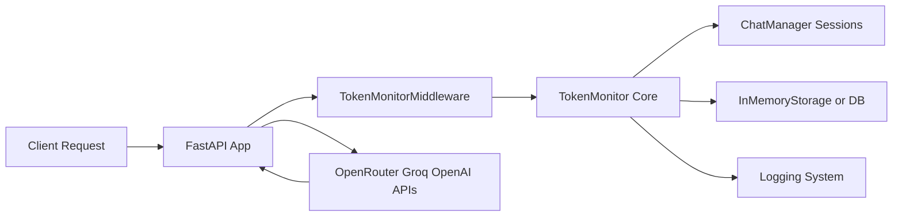
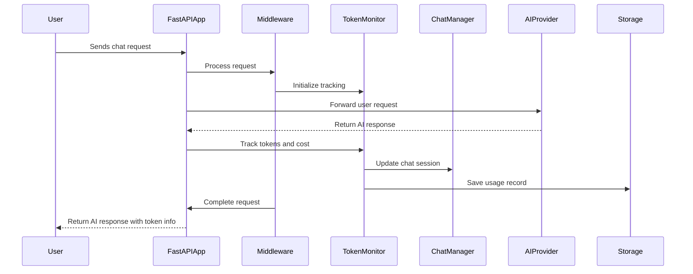

# AI-Token-Monitor 🚀

Track token usage and cost for OpenRouter Groq and OpenAI — with seamless FastAPI integration  
Monitor every token spent per request chat session plus cost estimation using real model pricing

---

## Table of Contents
- [Introduction](#introduction-📖)
- [Features](#features-✨)
- [Architecture](#architecture-🏗️)
- [Workflow](#workflow-🔄)
- [Tech Stack](#tech-stack-🛠️)
- [Installation](#installation-📥)
- [Project Structure](#project-structure-🗂️)
- [Usage](#usage-🚀)

---

## Introduction 📖

With the rise of AI APIs token usage and cost tracking is critical for budgeting and analytics  
AI-Token-Monitor provides transparent detailed monitoring of token consumption and cost across OpenRouter Groq and OpenAI with FastAPI middleware support  
Ideal for developers teams and organizations relying on multiple AI providers who want unified and accurate token cost insights

| Feature             | AI-Token-Monitor     | Alternative A          | Alternative B          |
|---------------------|----------------------|-----------------------|-----------------------|
| Multi-provider support | ✅ OpenRouter Groq OpenAI | ❌ Single provider only | ✅ OpenAI only         |
| Real-time token tracking | ✅ Per request & chat session | ❌ Batch only          | ❌ Per request limited |
| Cost estimation with real pricing | ✅ Updated pricing per model | ❌ Static pricing       | ❌ No cost estimation  |
| FastAPI middleware integration | ✅ Built-in middleware | ❌ Requires manual setup| ❌ No middleware       |
| Multi-turn chat session management | ✅ Included          | ❌ No session tracking  | ❌ No session tracking |
| Production logging    | ✅ Structured logs     | ❌ Basic logs          | ❌ No logging          |

---

## Features ✨

### Core Features
- 🧮 Track tokens per request and aggregate by chat session for detailed insights
- 💰 Estimate costs using real up-to-date pricing for OpenRouter Groq and OpenAI models
- 🔄 Manage multi-turn chat sessions maintaining token and cost summaries
- 🧩 Normalize responses from various AI SDKs for unified processing

### Developer Experience
- 🚀 Simple FastAPI middleware for automatic token logging on every request
- 🧰 In-memory storage with easy extension points for persistent backends
- 📝 Structured logs for production monitoring and debugging

### Deployment
- 📦 Available as a PyPI package for easy installation
- 🔐 Environment variable support for API keys and configuration
- ⚙️ Lightweight and framework agnostic core with optional FastAPI integration

---

## Architecture 🏗️



| Component            | Role                                        | Technology           |
|----------------------|---------------------------------------------|----------------------|
| Client               | Sends requests to AI APIs via FastAPI       | HTTP clients         |
| FastAPI App          | API endpoint and integration point          | FastAPI              |
| TokenMonitorMiddleware | Intercepts requests logs tokens and costs   | Starlette Middleware |
| TokenMonitor Core    | Processes responses tracks tokens calculates costs | Python core logic    |
| ChatManager          | Manages multi-turn chat sessions             | Python dict UUID     |
| Storage              | Persists token log records                    | InMemory / DB        |
| Logger               | Logs structured info for monitoring           | Python logging       |
| AI Providers         | External AI APIs providing completions        | OpenRouter Groq OpenAI|

---

## Workflow 🔄



1. User sends a chat request to the FastAPI application  
2. Middleware intercepts the request and prepares token tracking  
3. FastAPI forwards the request to the selected AI provider  
4. AI provider returns the response to FastAPI  
5. TokenMonitor parses response counts tokens estimates cost  
6. ChatManager updates current chat session statistics  
7. Usage data is saved to storage for future analysis  
8. Middleware completes request lifecycle  
9. FastAPI returns AI response enriched with token usage data to user

---

## Tech Stack 🛠️

| Layer              | Technology          | Purpose                          |
|--------------------|---------------------|---------------------------------|
| Web Framework      | FastAPI             | API endpoint and middleware     |
| Middleware         | Starlette Middleware| Request interception and logging|
| Core Logic         | Python              | Token counting cost estimation  |
| Storage            | InMemoryStorage     | Temporary usage data persistence|
| Logging            | Python logging      | Structured logs for monitoring  |
| AI Providers       | OpenRouter Groq OpenAI | AI completion APIs             |
| Environment Config | python-dotenv        | Load API keys from .env         |

---

## Installation 📥

### Prerequisites
- Python 3.8 or higher  
- API keys for OpenRouter Groq or OpenAI (optional but recommended)

### Quick Start

```bash
git clone https://github.com/Tharanika-R-Git/AI-Token-Monitor.git
cd AI-Token-Monitor
pip install ai-token-monitor
```

### Environment Setup

```bash
cp .env.example .env
# Fill in your API keys and configuration values in .env
```

---

## Project Structure 🗂️

```
AI-Token-Monitor/
├── ai_token_monitor/
│   ├── __init__.py          # Package entry point
│   ├── chat.py              # Chat session management
│   ├── logger.py            # Logging setup
│   ├── middleware.py        # FastAPI middleware for token tracking
│   ├── monitor.py           # Core token monitor logic
│   ├── pricing.py           # Model pricing data and cost calculations
│   ├── storage.py           # In-memory data storage
│   └── utils.py             # Helper functions for response normalization
├── fastapi_app.py           # Example FastAPI app integrating TokenMonitor
├── output.jpg               # Sample output screenshot
├── README.md                # Project documentation
├── requirements.txt         # Python dependencies
└── .env.example             # Sample environment configuration
```

---

## Usage 🚀

### Basic Example

```python
from ai_token_monitor import TokenMonitor

monitor = TokenMonitor()

# Simulated AI API response
response = {
  "usage": {"prompt_tokens": 50, "completion_tokens": 30, "total_tokens": 80},
  "model": "gpt4o-mini"
}

monitor.track(response, model="gpt4o-mini")

print(f"Total tokens used {monitor.total_tokens}")
print(f"Total cost estimated {monitor.total_cost}")
```

### Advanced Example with FastAPI Middleware

```python
from fastapi import FastAPI
from ai_token_monitor.middleware import TokenMonitorMiddleware
from ai_token_monitor import TokenMonitor, ChatManager

app = FastAPI()
monitor = TokenMonitor()
chat_manager = ChatManager()

app.add_middleware(TokenMonitorMiddleware, monitor=monitor, chat_manager=chat_manager)

@app.post("/chat/")
async def chat_endpoint(user_id: str, message: str):
    chat_id = chat_manager.create_chat(user_id)
    # Call AI provider here and get response (pseudo code)
    response = await call_ai_provider(message)
    
    monitor.track(response, model=response["model"], chat_manager=chat_manager, chat_id=chat_id)
    
    return {"chat_id": chat_id, "response": response, "tokens_used": monitor.total_tokens}
```

---

Harness AI-Token-Monitor to gain full visibility into your token usage and costs across multiple AI providers with minimal effort and maximum flexibility!

## License
This project is licensed under the **MIT** License.

---
🔗 GitHub Repo: https://github.com/Tharanika-R-Git/AI-Token-Monitor
